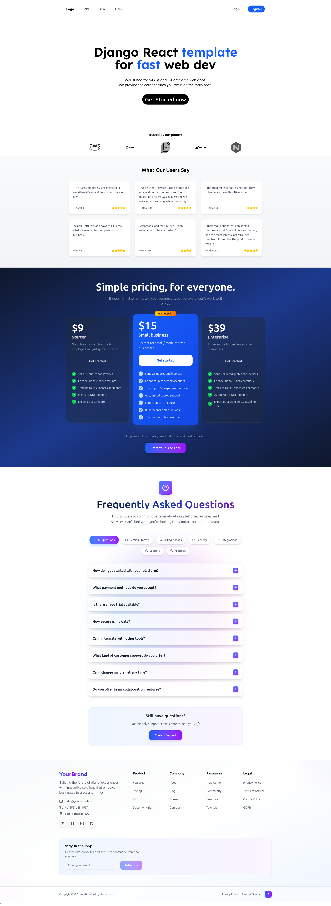
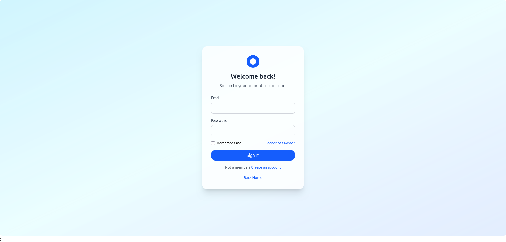
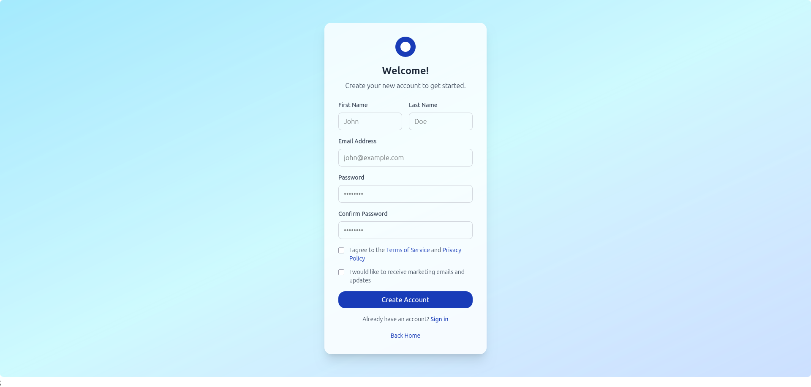

# Django-React-Template

A full-stack web app template with authentication, page routing, and pre-built components tailored for SaaS applications. It uses JWT tokens for secure session management and includes animated UI elements for a modern user experience.  

This template allows you to quickly bootstrap SaaS projects without reinventing the wheel or writing repetitive boilerplate code.  

## Tech Stack
- **Backend:** Python, Django  
- **Frontend:** TypeScript, React  
- **Styling:** Tailwind CSS  

## Features
- User authentication (login, register, logout)  
- JWT-based session management  
- Page routing and protected routes  
- Reusable and animated UI components  
- Ready-to-use SaaS application structure  

## Screenshots
**Home Page**  
  

**Login Page**  
  

**Register Page**  
  

## Getting Started
1. Clone the repository:  
   ```bash
   git clone [<repository-url>](https://github.com/kais-grati/Django-React-Template.git)
   ```  
2. Install frontend dependencies:  
   ```bash
   cd frontend
   npm install
   ```
3. Install backend dependencies:  
   ```bash
   cd backend
   pip install -r requirements.txt
   ```  
4. Run the development servers:  
   - Backend:  
     ```bash
     python manage.py runserver
     ```  
   - Frontend:  
     ```bash
     npm dev run
     ```  

## Contributing
Contributions are welcome! Feel free to open issues or submit pull requests to improve this template.  

## License
This project is licensed under the MIT License.  
